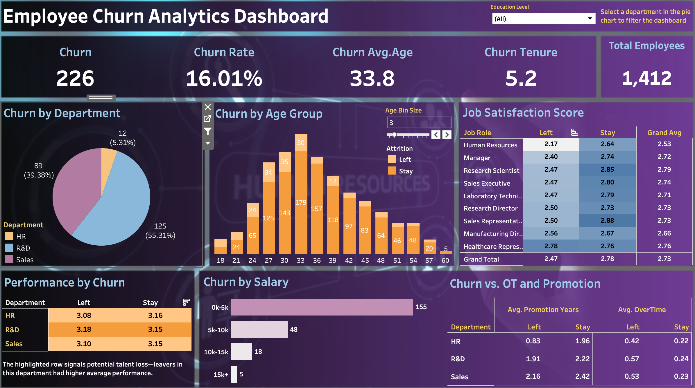

# About Me
Data professional with 3+ years of expertise in statistical modeling, large-scale data processing, and BI engineering.  
**Technical Proficiency:** Python, SQL, Tableau, QuickSight, R, Excel
## Projects
### 1. People Analytics: Employee Churn Predictive Analytics
To help HR identify and retain at-risk employees, I uncovered key drivers of voluntary churn through correlation analysis. Moreover, I built a predictive logistic regression model and an interactive Tableau dashboard, enabling HR to spot high-risk individuals and take proactive action.
- View the full project and README on GitHub: Project Link

(Click to explore the dashboard on Tableau Public)

### Project 2
